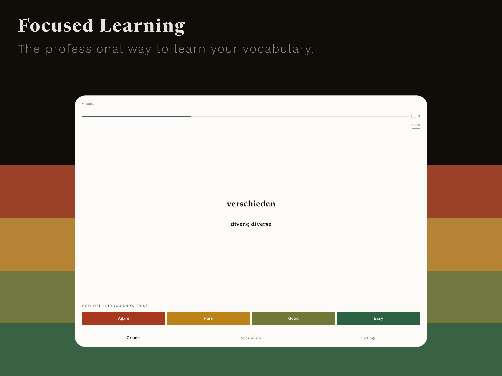
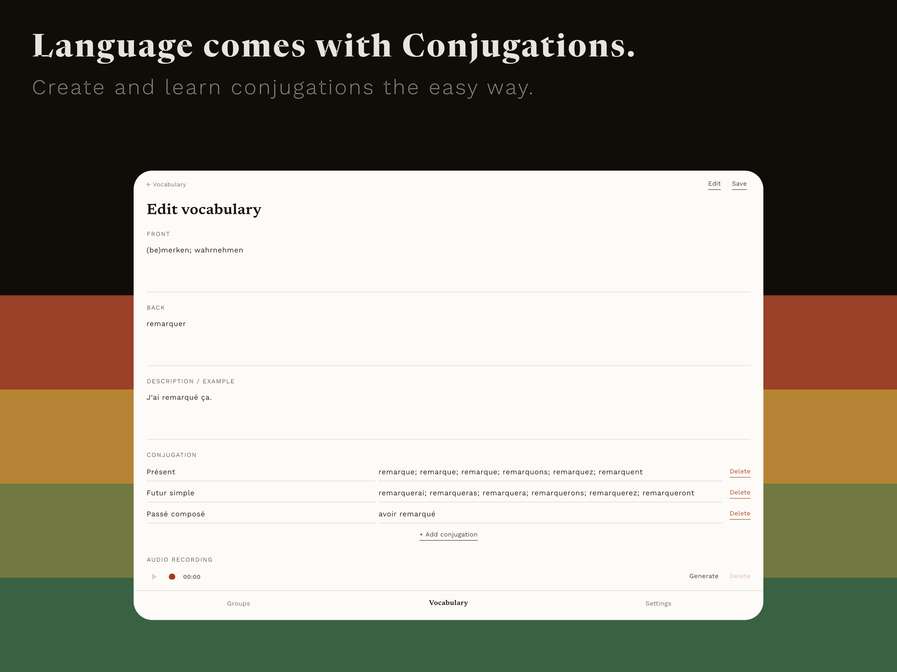
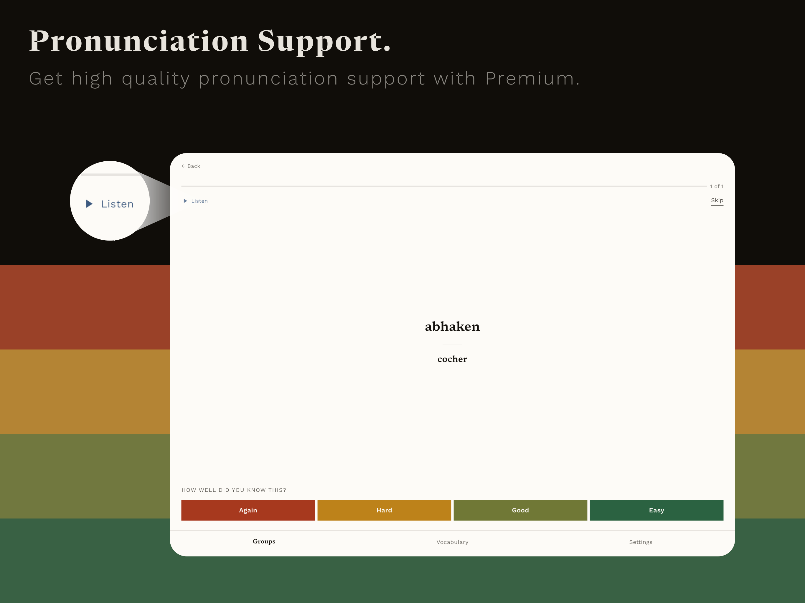

# Vocabulaire

> Learning vocabularies fast and efficient.
> Created for language learning.
> Created by language learners.

Vocabulaire is a focused iOS and macOS vocabulary trainer using the FSRS algorithm for best learning curves.

  
  
  
  

### Learn like there's no tomorrow:
To create the best experience for you, Vocabulaire uses
the [Free Spaced Repetition Scheduling Algorithm (FSRS)](https://github.com/open-spaced-repetition/free-spaced-repetition-scheduler).

FSRS bases on the three variables `difficulty`, `stability` and `retrievability`. These variables are updated in the
review process by applying a rating (`easy`, `good`, `hard`, `again`).

* The `difficulty` refers to the rating you give a vocabulary and affects the `retrievability` and `stability`.
* A vocabulary with a higher `stability` stays longer in memory than a vocabulary with a smaller `stability`.
* The lower the `retrievability` the higher are the chances that the vocabulary will be forgotten.

See [this technical explanation of FSRS](https://expertium.github.io/Algorithm.html#s-stability) for more information.

Furthermore, set a daily limit for new cards and stay in control of your learning workload.

### Listen to learn

Vocabulaire is connected to Google's Text-To-Speech giving you natural pronunciation support for Premium users.
Users without Premium can record their own voice.
By this, you can train vocabulary and pronunciation at the same time.

### The professional way to learn a language

Vocabulaire is focused on language learners.
This is why we offer a built-in conjugation editor: store verb tenses for each word and learn them as their own cards.

However, Vocabulaire can also be used for non-vocabulary by allowing the creation of classic flashcard sets for anything beyond languages.

### Whether on the go or at home

Synchronize vocabulary, pronunciations, and learning progress across iPhone, iPad, and Mac.
Import and export entire vocabulary boxes, including audio files, to back up or share.

### Crystal clear, zero distractions

With a focused, clean, and beautiful design we offer the perfect environment for professional language learners.

### Want a bit more? Get Premium:

Create unlimited vocabulary, groups, and boxes locally and learn offline — completely free.
However, if you want to use synchronization across all your devices and server-based pronunciation you can update to Premium.

## Using Speed Repetition Algorithm

To create the best experience for you, Vocabulaire uses
the [Free Spaced Repetition Scheduling Algorithm (FSRS)](https://github.com/open-spaced-repetition/free-spaced-repetition-scheduler).

FSRS bases on the three variables `difficulty`, `stability` and `retrievability`. These variables are updated in the
review process by applying a rating (`easy`, `good`, `hard`, `again`).

* The `difficulty` refers to the rating you give a vocabulary and affects the `retrievability` and `stability`.
* A vocabulary with a higher `stability` stays longer in memory than a vocabulary with a smaller `stability`.
* The lower the `retrievability` the higher are the chances that the vocabulary will be forgotten.

See [this technical explanation of FSRS](https://expertium.github.io/Algorithm.html#s-stability) for more information.
